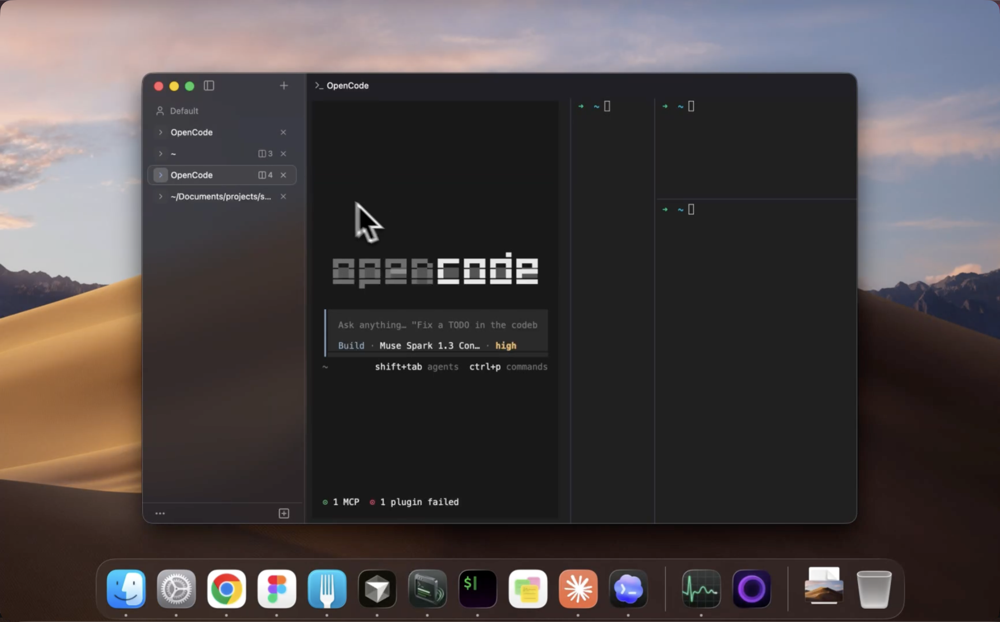

# superterminal



A GPU‑rendered, native multiplexer terminal for Windows, Linux and Mac. Rust server (`superterminald`) owns the terminals; a Bun 1.4.0 + React client renders them through [gpuix](https://github.com/remorses/gpuix) (React bindings for Zed's GPUI) with a native Rust `<terminal-grid>` element.

**Status: implemented and in daily use.** Terminals live in a background
server, so closing the window never kills a program and reopening it is
instant. Windows (native client against a WSL server) and macOS (Apple silicon)
ship as installers; Linux and WSLg run from source.

## Download

Grab the latest build from [Releases](https://github.com/sonnylazuardi/superterminal/releases):

- **Windows**: `Superterminal-<version>.msi`, a per-user install with no admin
  prompt. The daemon runs in WSL2; setup is in
  [`docs/WINDOWS.md`](./docs/WINDOWS.md#install-from-a-release).
- **macOS**: `superterminal-<version>-arm64.dmg`. It is ad-hoc signed, not
  notarized, so open it the first time with right-click → Open.

## Features

- **Terminals that outlive the window.** A per-user server owns every shell.
  Quit the app, reopen it, and every tab, split and scroll position is back.
- **Sessions, tabs and split panes**, in a sidebar or a top strip. Right-click
  a tab for Split Right, Split Down and Close; drag dividers to resize.
- **GPU rendering** through Zed's GPUI, with block-art and box-drawing
  characters drawn from the cell itself, so logos tile without seams.
- **One palette for everything** (⌘K on macOS, Ctrl+K on Windows and Linux).
  Commands, tabs and sessions share one list. Type part of a tab's title, its
  directory, or **anything visible on its screen** to jump to it. Screen search
  runs locally and needs no key: the server returns the visible rows of every
  tab, including ones not on screen, and the matching line shows beside the row.
- **Plain-words queries with Jev** (optional, below).
- Plain-text `config.toml` for font, theme, shell and keybindings;
  `st config init` writes a commented copy of every default.

### Shortcuts

| Action | macOS | Windows / Linux |
|---|---|---|
| Command palette | ⌘K or ⌘⇧P | Ctrl+K or Ctrl+Shift+P |
| New tab / close tab | ⌘T / ⌘W | Ctrl+Shift+T / Ctrl+Shift+W |
| Split right / split down | ⌘D / ⌘⇧D | Ctrl+Shift+D / Alt+Shift+D |
| Go to tab 1–9 | ⌘1…⌘9 | Alt+1…Alt+9 |
| Switch session | ⌘⇧S | Ctrl+Shift+S |

Ctrl+K takes readline's kill-to-end-of-line on Windows and Linux. To give it
back, add `"palette.commands" = "ctrl+shift+p"` under `[keybindings]`.

## Jev: plain-words palette queries

With a key, the palette also understands what you *mean*. "kill this tab",
"split below", "make the text bigger", "the frontend one" and "the busy one"
land on the right row even when no title contains those words.

The ranking comes from [Jev](https://docs.typesafe.ai/introduction),
TypeSafe's System One model. Jev does not generate text. The palette sends the
query and the list of rows as one typed question, and Jev returns a
calibrated probability for each row. Local matching still answers every
keystroke instantly. A settled query is ranked about a quarter of a second
later, and a confident pick moves to the top, marked ✦. Enter always acts on
the row under the cursor, so a slow or missing answer never gets in the way.

**Providers.** Jev is available directly from TypeSafe or through OpenCode Zen:

| | TypeSafe (direct) | OpenCode Zen |
|---|---|---|
| Key | [console.typesafe.ai/keys](https://console.typesafe.ai/keys), starts with `apikey_` | your [OpenCode](https://opencode.ai/docs/zen/) login is picked up automatically |
| Model | `jev-1.13.0` | `jev-1.13` |
| Median latency on the palette test set | 290 ms | 654 ms |

**Setup.** Open the palette, run **AI Settings…**, paste a key and press
Enter. The dialog saves it, runs a connection test and reports the provider,
the model that answered and the latency. The provider row cycles
Auto → TypeSafe → OpenCode Zen. Auto, the default, uses TypeSafe when it
finds a TypeSafe key and otherwise falls back to Zen.

The same settings in `config.toml`:

```toml
[ai]
provider = "auto"      # or "typesafe" / "zen"
# api_key = "apikey_…" # or set TYPESAFE_API_KEY
```

A key is looked up in this order: `api_key` in `config.toml`, the key saved by
the dialog, the `TYPESAFE_API_KEY` or `SUPERTERMINAL_AI_API_KEY` environment
variable, then OpenCode's own login. The dialog stores one key per provider in
`secrets.json` next to the window state and never shows more than its last
four characters.

**What leaves your machine.** Without a key, nothing. With one, a palette
query sends the query, command titles, tab titles, working directories and
session names to the provider you picked. Screen text is **not** sent unless
you turn on `[ai] screen_context`, which is off by default. Even then only a
short excerpt of each tab goes out, with bearer tokens, API keys, private keys
and `password=`/`token=` values masked first.

Design notes: [`docs/plan/08-jev-palette.md`](./docs/plan/08-jev-palette.md)
(the palette) and [`docs/plan/09-typesafe-endpoint.md`](./docs/plan/09-typesafe-endpoint.md)
(providers). `bun scripts/jev-palette-probe.ts --provider typesafe|zen` re-runs
the 15 test queries against a live endpoint.

## Architecture

- **Server** (`superterminald`): per-Surface PTYs over `portable-pty`,
  `alacritty_terminal` VT engine behind the `VtEngine` trait, Snapshot/Delta
  fan-out with ack window and slow-client Snapshot, Workspace actor
  (Sessions → Tabs → Panes → Surfaces), `workspace.json` persistence with cwd
  tracking, idle exit, `st` CLI (`status`, `ls`, `probe`, `kill-server`,
  `dump-data`, `config`).
- **Protocol** (`st-proto`, version 1.1): Control Plane (NDJSON) + Data Plane
  (`u32 len | u16 type | postcard`) on one sniffed socket, plus **loopback
  TCP** (`--tcp`, `tcp://`) for the Windows/WSL split. 1.1 added split Panes
  and `surface.screen_text`.
- **Client**: Bun + React chrome on [gpuix](https://github.com/remorses/gpuix)
  with a native Rust `<terminal-grid>` element (run-shaping cache, selection,
  mouse reporting, scrollbar + lazy history, resize, IME/focus handling).
  Cell data never passes through JavaScript. The AI ranking lives in the
  client (`packages/app/src/ai/`); the server makes no network calls.
- **Platforms**: Linux/WSLg and native Windows (MSVC build, Direct3D,
  per-user MSI, no-console exe) against a WSL daemon; macOS on Apple silicon
  (Metal, CoreText), packaged as an ad-hoc signed `.app` + `.dmg`.

## Run and build

Run the Server as a **release** build for daily use
(`cargo build --release -p st-server -p st-cli`). A debug Server is for
development only: it is much slower, and with the default 10 000-line
scrollback the Server's memory is dominated by scrollback itself, roughly
40 MB per busy Surface at 168 columns — a debug build holds the same rows with
worse overhead. Release builds keep the budget in the handover
(`docs/handover-reattach-memory-placement.md` §B). Debug builds stay useful for
development and `RUST_LOG` tracing.

### Linux (incl. WSL2 — the primary dev setup)

```bash
# prerequisites: rustup (stable + 1.97.1), Bun 1.4.0, GPU/dev libraries —
# full list in docs/DEV.md §1
git clone <repo> && cd superterminal
git submodule update --init
git -C vendor/gpuix submodule update --init --depth 1 --recursive zed
for p in patches/*.patch; do git -C vendor/gpuix apply "../../$p"; done
./scripts/run.sh              # build what is missing, start daemon + client
./scripts/run.sh --no-build   # run what is already built
```

The window appears via WSLg (X11 backend for real decorations). Headless
checks anytime: `./target/debug/st status`, `st ls`, `st probe <id>`.

### Windows (native client, WSL server)

```powershell
# prerequisites: Rust stable MSVC, VS 2022 Build Tools with C++ workload,
# Bun 1.4.x, Git for Windows — details in docs/WINDOWS.md
git clone <repo>; cd superterminal
git submodule update --init
git -C vendor\gpuix submodule update --init --depth 1 --recursive zed
# apply patches\*.patch inside vendor\gpuix, then:
cd crates\st-native; cargo build; cd ..\..
copy target\debug\st_native.dll dist\superterminal-native.win32-x64-msvc.node
bun install
```

```powershell
# terminal 1 (WSL):  superterminald --tcp 127.0.0.1:7171
# terminal 2 (Windows):
$env:SUPERTERMINAL_TCP = "127.0.0.1:7171"
$env:NAPI_RS_NATIVE_LIBRARY_PATH = "C:\...\superterminal\crates\st-native\dist\superterminal-native.win32-x64-msvc.node"
bun packages\app\src\app.tsx
```

Packaged form: `packaging/windows/` builds `superterminal.exe` +
side-by-side `.node` (`bun build --compile`, then `editbin /SUBSYSTEM:WINDOWS`
for no-console launch) and a per-user MSI (WiX 3.11). Full chain in
[`docs/WINDOWS.md`](./docs/WINDOWS.md).

### macOS (Apple silicon)

```bash
xcode-select --install       # Metal / CoreText come with the SDK, nothing else
rustup toolchain install 1.97.1
git submodule update --init && just vendor-patch
./scripts/run.sh             # builds the daemon + native module, then launches
./scripts/run.sh --no-build  # relaunch what is already built
```

`scripts/env.sh` picks the Darwin triple, toolchain and socket dir
(`$TMPDIR/superterminal-<uid>`); the client falls back to Menlo when the
generic `monospace` face is missing. Packaged form: `just dmg` (or
`just dmg --no-build`) writes `dist/superterminal.app` and a `.dmg`, with the
daemon and `st` beside the client, `assets/superterminal.icns` for Dock and
Finder, and, with Xcode 26+ `actool`, a Liquid Glass `Assets.car` compiled
from `assets/superterminal.icon`. The bundle is ad-hoc signed only: no
Developer ID, no notarization, so a downloaded copy still trips Gatekeeper.
Bring-up notes and the bugs the first Mac run found are in `docs/DEV.md`
"macOS bring-up".

## Roadmap (plan → reality)

From [`docs/plan/07-milestones.md`](./docs/plan/07-milestones.md):

- [x] **M0** De-risk & skeleton — toolchain end to end, vendored gpuix 0.7.0
  with the factory-hook + mouse-lease patches, `<hello-box>`.
- [x] **M1** Protocol + server core — frozen wire types, PTY engine,
  attach/detach fan-out, `st probe` on a live grid, history.
- [x] **M2** Native grid gate — `<terminal-grid>` paints live Deltas; app
  shows a real prompt.
- [x] **M3** Input & interaction — keys, mouse + selection, clipboard,
  wheel/alt-screen, scrollbar paging, cursor shapes, resize.
- [x] **M4** Workspace + chrome — control-plane commands, sessions/tabs,
  palette, banners, reconnect, persistence; vertical sidebar default.
- [~] **M5** Polish — config TOML, themes, exited UX, bell, cwd inheritance,
  `st status`, fonts/emoji/HiDPI fixes and the macOS GUI bring-up all
  landed; macOS blur/traffic-light fit and multi-day dogfooding still open.
- [~] **M6** Packaging — Windows exe + per-user MSI and the macOS `.app` +
  `.dmg` (app icon, Liquid Glass) ship and install; signing/notarization,
  Linux tarball, release CI, nightly perf still open.
- **[+] Beyond the plan** — loopback TCP transport, Windows-client/WSL-server
  split, gpuix 0.7.0 bump, `fixing-gpuix-layout` skill, remembered window
  size / tab layout / sidebar width (Client State, ADR 0008), **split Panes**
  with a right-click tab Menu and draggable dividers (ADR 0009, protocol 1.1),
  the **unified palette** with screen-text search, and **Jev ranking** through
  TypeSafe or OpenCode Zen (plans 08 and 09).
- **[ ] Out of scope (unchanged)** — remote SSH, web client, ligatures,
  graphics protocols, scrollback search (the palette searches the visible
  screen only), signing/notarization.

## Documents

| File | Purpose |
|---|---|
| [`HANDOVER.md`](./HANDOVER.md) | Entry point for an AI agent (or human) picking up implementation |
| [`CONTEXT.md`](./CONTEXT.md) | Ubiquitous language / glossary — use these words everywhere |
| [`docs/DEV.md`](./docs/DEV.md) | Building and running on Linux/WSL and macOS, debugging, bring-up notes |
| [`docs/WINDOWS.md`](./docs/WINDOWS.md) | Windows client against a WSL server: install, build, packaging |
| [`docs/config-example.toml`](./docs/config-example.toml) | Every `config.toml` key with its default, generated from the schema |
| [`docs/plan/00-grilling.md`](./docs/plan/00-grilling.md) | The 58 decisions, with reasoning, that everything else depends on |
| [`docs/plan/01-architecture.md`](./docs/plan/01-architecture.md) | Processes, threads, connections, crate layout, failure modes |
| [`docs/plan/02-protocol.md`](./docs/plan/02-protocol.md) | Wire protocol: Control Plane (JSON) and Data Plane (binary) |
| [`docs/plan/03-server.md`](./docs/plan/03-server.md) | `superterminald`: workspace actor, VT engine, PTYs, persistence |
| [`docs/plan/04-client-native.md`](./docs/plan/04-client-native.md) | Rust native module: gpuix patch, Replica, `<terminal-grid>` painting & input |
| [`docs/plan/05-client-app.md`](./docs/plan/05-client-app.md) | Bun/React chrome: tabs, sessions, palette, control‑plane client, packaging |
| [`docs/plan/06-testing-perf-ci.md`](./docs/plan/06-testing-perf-ci.md) | Test pyramid, VT conformance, perf budgets, CI |
| [`docs/plan/07-milestones.md`](./docs/plan/07-milestones.md) | M0–M6 work breakdown with task ids, estimates, acceptance tests |
| [`docs/plan/08-jev-palette.md`](./docs/plan/08-jev-palette.md) | The unified palette, screen-text search and Jev ranking |
| [`docs/plan/09-typesafe-endpoint.md`](./docs/plan/09-typesafe-endpoint.md) | TypeSafe's direct endpoint as a second Jev provider |
| [`docs/adr/`](./docs/adr/) | Architecture decision records (the hard‑to‑reverse choices) |

## License

[MIT](./LICENSE).
