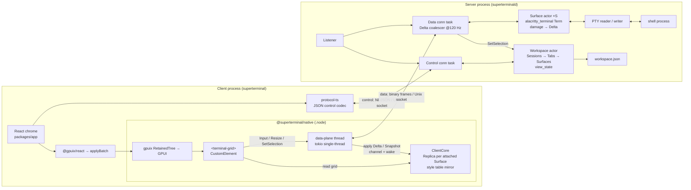
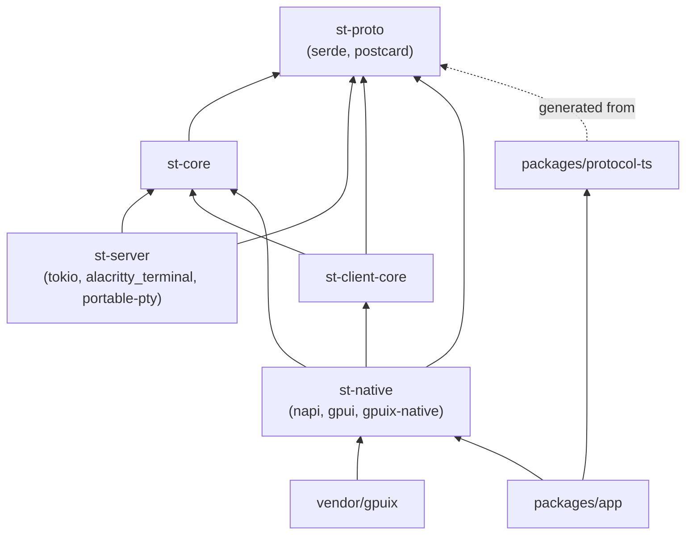

# 01 — Architecture

Status: planning document. Every decision referenced here is frozen in `00-grilling.md` (cited as Q*n*); this document arranges those decisions into processes, threads, crates and failure paths. Anything not settled there is listed under *Open questions* rather than decided here.

Vocabulary (Q19): **Server** (`superterminald`), **Client** (GUI process), **Workspace**, **Session**, **Tab**, **Surface**, **Replica**, **Attach**, **Snapshot**, **Delta**.

---

## 1. System overview

Two processes, two connections, three languages of state.

| Process | Binary | Runtime | Owns |
|---|---|---|---|
| Server | `superterminald` (cargo release binary) | tokio multi-thread | PTYs, one `alacritty_terminal` state machine per Surface, the Workspace document, the style tables, the Unix socket listener |
| Client | `superterminal` (Bun single-file executable embedding `@superterminal/native`) | Bun JS event loop + GPUI main thread | React chrome, Replicas, glyph rendering, window, clipboard, key encoding |

### 1.1 Threads

**Server (`superterminald`)**

| Thread / task | Kind | Responsibility |
|---|---|---|
| tokio worker pool | N OS threads | Runs all tasks below |
| Listener task | tokio task | Accepts on `$XDG_RUNTIME_DIR/superterminal/sock`; reads the first frame to classify the connection as control (JSON) or data (binary) |
| Connection task ×N | tokio task per connection | Framing, `Hello` handshake, dispatch to Workspace actor / Surface actors, outbound queue with Delta coalescing (Q27) |
| Workspace actor | one tokio task | Single writer of `Workspace` (Sessions → Tabs → Surfaces → `view_state`); persists `workspace.json` on change (Q18); broadcasts `WorkspaceChanged` events |
| Surface actor ×S | one tokio task per Surface | Owns `Term<EventProxy>` + PTY writer; feeds bytes to the parser; turns damage into Deltas; serves `FetchHistory` |
| PTY reader ×S | tokio task on `AsyncFd` (or `spawn_blocking` if the platform fd cannot be made non-blocking) | Reads PTY output, forwards `Bytes` to its Surface actor |
| Child reaper | one task | `SIGCHLD`/`waitpid` → `Surface::Exited{code}` (Q22) |
| Idle timer | one task | Exits the server after N idle minutes *and* zero Surfaces (Q30) |

**Client (`superterminal`)**

| Thread | Kind | Responsibility |
|---|---|---|
| Main thread | Bun JS loop + GPUI platform loop (as arranged by `gpuix-native`; we inherit it unchanged) | React reconciliation → `applyBatch` → `RetainedTree`; GPUI layout/paint; `<terminal-grid>` element paints from Replicas; key/mouse handling |
| Data-plane thread | one `std::thread` running a single-thread tokio runtime (owned by `st-native`) | Owns the data-plane Unix socket; decodes frames; applies Deltas to Replicas; wakes the main thread (§5) |
| Bun I/O | Bun's internal threads | `Bun.connect` control socket, `Bun.spawn` of the server, config file reads |

### 1.2 The two connections (Q14, Q15)

| | Control plane | Data plane |
|---|---|---|
| Endpoints | Bun (`Bun.connect`) ↔ Server | `st-native` (Rust) ↔ Server |
| Encoding | newline-delimited JSON | `u32 len \| u16 type \| postcard payload`, little-endian |
| Traffic | create/close Tab, list/rename Session, `SetViewState`, `WorkspaceChanged` events, version banner | `Attach`/`Detach`, `Snapshot`, `Delta`, `Input`, `Resize`, `FetchHistory`, `SetSelection` |
| Cadence | tens of messages per minute | up to 120 Hz per Surface per client |
| Debug | `socat - UNIX-CONNECT:…` | `st-proto` ships a `st-dump` frame decoder |

Both connections share one socket path; the first frame from any connection is a `Hello` whose `plane` field selects the codec for the rest of the connection. Ordering between planes is by construction (Q14): JS learns a `SurfaceId` from a control-plane reply before it mounts `<terminal-grid surfaceId>`, and mounting is what triggers the data-plane `Attach`.

---

## 2. Diagrams

### 2.1 Components and data flow



### 2.2 Launch → attach → first paint, then quit → relaunch

```mermaid
sequenceDiagram
  participant U as User
  participant B as Bun (React + control)
  participant N as st-native (data plane)
  participant S as superterminald
  participant P as Shell (PTY)

  U->>B: launch superterminal
  B->>B: socket absent? Bun.spawn(superterminald, detached)
  B->>S: control Hello{proto_version, build_id}
  S-->>B: HelloAck + WorkspaceSnapshot (Sessions, Tabs, view_state)
  Note over B: empty Workspace → CreateTab in default Session
  B->>S: CreateTab{session}
  S->>P: openpty + spawn shell (cwd from config)
  S-->>B: WorkspaceChanged{tab, surface_id}
  B->>N: mount <terminal-grid surfaceId>
  N->>S: data Hello{plane: Data} then Attach{surface_id, cols, rows}
  S-->>N: Snapshot{grid, styles, cursor, modes, view_state, seq}
  N->>N: build Replica, wake main thread
  N-->>U: first paint (< 100 ms warm)
  P-->>S: output bytes
  S-->>N: Delta{seq+1, dirty rows…}
  N-->>U: repaint (coalesced per frame)

  U->>B: quit client (⌘Q)
  B->>S: control socket closes; N's data socket closes
  S->>S: Detach all Surfaces of that client; Surfaces keep running
  Note over S,P: shell keeps running, output accumulates in Term

  U->>B: relaunch superterminal
  B->>S: control Hello (socket present → no spawn)
  S-->>B: WorkspaceSnapshot (same Tabs, selection, scroll_offset)
  B->>N: mount <terminal-grid surfaceId> for the active Tab
  N->>S: Attach{surface_id}
  S-->>N: Snapshot (current grid, selection preserved)
  N-->>U: first paint — "half a dock bounce"
```

---

## 3. Ownership model

### 3.1 Server side: Workspace → Session → Tab → Surface

```rust
// st-core (server-side model; ids are u64 newtypes minted by the Workspace actor)
pub struct Workspace { sessions: Vec<Session>, active_session: SessionId }
pub struct Session   { id: SessionId, name: String, tabs: Vec<Tab>, active_tab: TabId }
pub struct Tab       { id: TabId, layout: Layout }          // v1: always Layout::Leaf
pub enum   Layout    { Leaf(SurfaceId) /* Split{..} reserved, §7 */ }
pub struct SurfaceMeta {
    id: SurfaceId, cwd: PathBuf, title: String,
    state: SurfaceState,                         // Running | Exited{code}
    view_state: ViewState,                       // scroll_offset, selection (Q17)
}
```

The **Workspace actor** owns `Workspace` and every `SurfaceMeta`. The **Surface actor** owns the heavy, non-serialisable part: `Term<EventProxy>`, the PTY handles, the style-intern table, and the per-subscriber `seq` counters. The split is deliberate: `Workspace` is small and serialised to `workspace.json` on every change (Q18); the Surface actor's state is never serialised and dies with the server.

Lifetimes follow Q21: closing a Tab kills its Surface (SIGHUP the process group, then drop the actor); a client quitting only detaches; the last Tab in a Session removes the Session unless it is the last Session, which is re-seeded.

### 3.2 Client side: one Replica per attached Surface

```rust
// st-client-core (no GPUI, no napi; also compiles to wasm, §7)
pub struct Replica {
    surface: SurfaceId,
    seq: u64,                       // last applied Delta
    cols: u16, rows: u16,
    screen: Vec<Row>,               // visible grid, Row = Box<[Cell]>
    history: HistoryRing,           // lazily filled by FetchHistory (Q16, Q25)
    styles: StyleTable,             // mirror of the server's interned table
    cursor: Cursor, modes: Modes, title: String,
    view: ViewState,                // projected copy; edits round-trip via server (Q17)
}
pub struct Cell { cp: u32, style: u16, flags: u8 }   // packed per Q16
impl Replica {
    pub fn apply_snapshot(&mut self, s: &Snapshot);
    pub fn apply_delta(&mut self, d: &Delta) -> Result<Dirty, SeqGap>;  // SeqGap → re-Attach
}
```

`ClientCore` (in `st-native`) holds `HashMap<SurfaceId, Replica>` behind a mutex that the data-plane thread writes and the GPUI main thread reads during paint. Only visible Tabs have a mounted `<terminal-grid>` and therefore an Attach; background Tabs hold no Replica (their grid is re-Snapshotted on switch, which is cheap: one screen of rows).

### 3.3 Where state is authoritative

| State | Authoritative | Copy | How the copy is refreshed |
|---|---|---|---|
| Process, PTY, exit code | Server (Surface actor) | — | — |
| Terminal grid, cursor, modes, title | Server (`Term`) | Client Replica | `Snapshot` on Attach, `Delta` stream after |
| Scrollback history | Server | Client `HistoryRing` (partial) | `FetchHistory{from,count}` in 1 000-row pages |
| Style table | Server (interned per Surface) | Client mirror | New entries ride inside `Delta.new_styles` |
| Sessions, Tabs, order, names, active Tab | Server (Workspace actor) | Bun `WorkspaceStore` (React state) | `WorkspaceSnapshot` on connect, `WorkspaceChanged` events |
| `view_state` (scroll offset, selection) | Server (Workspace actor) | Client Replica + React | Client applies locally first for latency, then sends `SetViewState`/`SetSelection`; server echo wins on conflict |
| Selection *computation* (hit-testing) | Client | — | Local on Replica (Q24) |
| Window geometry, focus, palette query, font metrics | Client only | — | Never sent |
| Config (`config.toml`) | File | Both processes read | Each reads at startup (Q34) |
| Protocol version, build id | Each binary | — | Compared in `Hello` (Q31) |

---

## 4. Crate and package layout

```
superterminal/
├── Cargo.toml                 # workspace: crates/*
├── package.json               # bun workspaces: packages/*
├── justfile
├── crates/
│   ├── st-proto/
│   ├── st-core/
│   ├── st-server/
│   ├── st-client-core/
│   └── st-native/
├── packages/
│   ├── app/                   # @superterminal/app
│   └── protocol-ts/           # @superterminal/protocol
├── vendor/gpuix/              # git submodule + patch (Q12)
└── docs/
```

**`crates/st-proto`** — The wire contract and nothing else. Frame header, `Hello`, every control and data message as `serde` structs/enums, the packed `Cell` layout, and `encode`/`decode` helpers. Dependencies: `serde`, `postcard` only (no tokio, no alacritty, no std I/O). Also hosts the `st-dump` example binary for decoding captured frames. Anything in this crate is a protocol change and bumps `PROTO_VERSION`.

**`crates/st-core`** — Shared domain types that both sides agree on but that are not wire messages: `SurfaceId`/`TabId`/`SessionId` newtypes, `Workspace`/`Session`/`Tab`/`Layout`/`ViewState`, the `StyleTable` interning logic, the VT `Engine` trait behind which `alacritty_terminal` sits (Q8), and the key-to-bytes encoder tables (Q23). Depends on `st-proto`.

**`crates/st-server`** — The `superterminald` binary. Listener, connection tasks, Workspace actor, Surface actors, PTY management via `portable-pty` (Q9), `alacritty_terminal` as the `Engine` implementation, Delta computation from damage, throttling, `workspace.json` persistence, lockfile and idle exit. Depends on `st-proto`, `st-core`, `tokio`, `alacritty_terminal`, `portable-pty`.

**`crates/st-client-core`** — The Replica and everything a client needs that is *not* rendering: `Replica`, `HistoryRing`, delta application, selection geometry (cell hit-testing, rectangular/linear ranges), and the data-plane client state machine (`Connecting → Hello → Attached{..} → Reconnecting`) expressed as a pure `poll`-style type that the caller feeds bytes into. No GPUI, no napi, no tokio — so it is testable with `proptest` (Q33) and compiles to `wasm32` (§7). Depends on `st-proto`, `st-core`.

**`crates/st-native`** — The `@superterminal/native` Node-API module (napi-rs v3, `crate-type = ["cdylib","rlib"]`). Depends on `gpuix-native` from the vendored submodule and re-exports its renderer; adds `TerminalGridFactory`/`TerminalGridElement` (the `CustomElement`), `ClientCore`, the data-plane thread, the GPUI wakeup bridge, glyph-run shaping cache, scrollbar integration, and a handful of napi exports (`connectDataPlane(path)`, `disconnect()`, `stats()`). Depends on `st-client-core`, `st-core`, `st-proto`, `gpuix-native`, `gpui`, `napi`, `tokio`.

**`packages/app`** — The Bun/React client. Window setup (Q28), tab strip, Session chip, command palette and registry (Q29), `WorkspaceStore`, the control-plane client (`Bun.connect`), server auto-spawn (Q30), version banner (Q31), and one `<terminal-grid surfaceId>` per visible Tab. Built with `bun build --compile --asset` (Q35). Depends on `@gpuix/react`, `@superterminal/native`, `@superterminal/protocol`.

**`packages/protocol-ts`** — TypeScript types and a tiny NDJSON codec for the *control plane only*, generated from `st-proto` (via `ts-rs` or `schemars` → JSON Schema → types, decided in `02-protocol.md`) so the two sides cannot drift. No data-plane types live here; JS never sees them (Q13).

**`vendor/gpuix`** — Submodule pinned to the 0.6.0 commit plus our ~30-line patch adding the factory-registration hook (Q12). Pins the Zed commit that gpuix pins (Q36a).

**`justfile`** — `just dev` (server in foreground + `bun --hot` client), `just build`, `just test` (cargo + bun), `just vendor-sync`, `just perf`.

### 4.1 Dependency graph (acyclic)



Rule: `st-proto` never depends on anything in the workspace; `st-core` never depends on tokio, GPUI or napi; `st-client-core` never depends on GPUI or napi. Server and client share code only through `st-proto` and `st-core`.

---

## 5. Threading and async model

### 5.1 Server

One `tokio` multi-thread runtime. Actors communicate over bounded `mpsc` channels; nothing shares a mutex across actors.

- **Workspace actor** is the single writer of `Workspace`. Control connection tasks send `WorkspaceCmd` (with a `oneshot` reply); the actor mutates, persists, and publishes `WorkspaceEvent` on a `broadcast` channel every control connection subscribes to. `SetSelection` arriving on the data plane is forwarded to this actor too, because `view_state` belongs to the Workspace document.
- **Surface actor** owns `Term` exclusively. Inputs: `Bytes` from the PTY reader, `Input`/`Resize`/`FetchHistory` from data connection tasks, `Kill`. After each batch of parsed bytes it drains `Term::damage()`, builds a `Delta` against the last acknowledged state per subscriber, and pushes it to each subscriber's `watch`-style slot (latest-wins). A subscriber slot, not a queue, is what makes coalescing free: a slow client always receives the newest complete state.
- **Data connection task** wakes on its slots at most every ~8 ms (Q27's 120 Hz), serialises, writes. Backpressure: if the socket write blocks, the slot keeps overwriting; no unbounded memory.
- **PTY reader** uses `tokio::io::unix::AsyncFd` on the master fd. The Surface actor batches reads to 64 KiB before parsing so `cat` of a large file is parsed in big chunks and produces one Delta per frame rather than one per `read()`.

### 5.2 Client native module

Two threads matter: the **GPUI main thread** and the **data-plane thread**.

The data-plane thread runs a single-thread tokio runtime owning the `UnixStream`. It decodes frames, locks `ClientCore`, applies the `Snapshot`/`Delta` to the right `Replica`, unlocks, and then **wakes the main thread**. Outbound traffic (`Input`, `Resize`, `SetSelection`, `FetchHistory`) goes the other way through an unbounded `mpsc` the element writes to from paint/event handlers; the thread's writer task drains it.

**Wakeup options considered**

| Option | Mechanism | Verdict |
|---|---|---|
| A. GPUI foreground task | At init, capture an `AsyncApp` (from the `App` the factory hook gives us). `cx.spawn` a foreground task that `await`s a `futures::channel::mpsc` receiver; each message calls `cx.refresh()` (or notifies the gpuix root entity). GPUI's foreground executor already knows how to wake the platform run loop from another thread. | **Chosen.** Pure GPUI, no JS hop, ~one channel send per Delta; coalescing falls out because the task drains everything pending before one `refresh`. |
| B. Per-Surface `Entity<ReplicaModel>` observed by the element | Element `cx.observe`s an entity that the data thread updates via `AsyncApp::update_entity`. | Cleaner invalidation (only the affected element repaints) but needs the element to hold entities across renders, which depends on gpuix's element lifetime rules (see Open questions). Planned as the M3 refinement of A. |
| C. napi `ThreadsafeFunction` → JS → prop bump | Data thread calls into JS, JS sets a `version` prop on `<terminal-grid>`, gpuix applies a batch. | Rejected for the hot path: adds two thread hops and a JSON batch per Delta; contradicts Q13. Kept only for rare events JS must see (`Exited`, title change → tab label). |

Repaint policy (Q27): the foreground task drains the channel, calls one `refresh`, and the element's `paint` reads the Replica under a short lock. Cursor blink is a GPUI timer inside the element. Deltas arriving mid-frame are applied to the Replica immediately and picked up by the next paint; nothing is ever dropped, only coalesced.

Key input never crosses to JS: the element's `FocusHandle` receives GPUI key events, `st-core`'s encoder turns them into bytes, and the element pushes `Input` onto the outbound channel — one thread hop to the socket.

---

## 6. Failure modes and recovery

| Failure | Detection | Client behaviour | Server behaviour | What is lost |
|---|---|---|---|---|
| Server crash / killed | Both sockets EOF; `Bun.spawn` retry loop sees socket absent | Banner "Server stopped — restarting"; Replicas frozen but still rendered (greyed); auto-spawn `superterminald`, reconnect with 3 s retry (Q30); on reconnect, `WorkspaceSnapshot` rebuilds Tabs from `workspace.json` shape (new shells, same cwds, Q18) | Fresh process reads `workspace.json`, reseeds Surfaces | All processes and scrollback; selection and Tab layout survive |
| Client crash / quit | Control and data sockets EOF | Relaunch → attach → Snapshot (§2.2) | Detaches that client's subscribers; nothing else | Nothing (Q21) |
| Only the data-plane socket drops | `st-native` read error | `ClientCore` enters `Reconnecting`; reconnects, re-`Attach`es every mounted Surface; `SeqGap` on any Replica forces a Snapshot | Old subscriber slots dropped on EOF | Nothing |
| Only the control-plane socket drops | `Bun.connect` close event | Reconnect, request `WorkspaceSnapshot`, diff into `WorkspaceStore` | — | Nothing |
| Stale socket file (server died uncleanly) | `connect()` → `ECONNREFUSED` while file exists | Treat as absent: unlink and spawn server; lockfile (`flock`) prevents two clients racing to spawn two servers | New server unlinks any stale path it can't connect to before `bind` | Same as server crash |
| Protocol version mismatch | `Hello` compare (Q31) | Banner with exact versions and a "Restart server (kills N running processes)" action | Refuses lower major with `HelloReject{reason}` and keeps serving existing clients | None unless the user restarts |
| Process in Surface exits | Reaper task | Tab badge "exited (code)"; grid stays readable; Enter/click closes (Q22) | `SurfaceState::Exited`; PTY closed; Term retained | Nothing |
| Replica `SeqGap` (missed Delta) | `apply_delta` returns `Err` | Detach/Attach the Surface → full Snapshot; log a counter | — | Nothing; a one-frame flash at worst |
| Slow client (paint stalls) | Server slot overwritten | Renders latest state when it catches up | Coalesces; never buffers unboundedly | Intermediate frames only |
| Config file invalid | TOML parse error at startup | Fall back to defaults, show a banner | Same, log | Nothing |

The invariant behind every row: the server never blocks on a client, and the client can always render *something* from the last Replica it has.

---

## 7. Hooks left for deferred features (Q5)

**Remote hosts via SSH.** Both planes are plain byte streams with a `Hello` handshake, so a remote server is reached by tunnelling the same Unix socket over `ssh -L`/`ssh -W` or by having `st-native` open the data plane through an `ssh` child's stdio. `ClientCore` keys Replicas by `(ServerId, SurfaceId)` from the start, and `SurfaceId`s are minted per server, so nothing collides when a second server appears. The Workspace document stays per-server; a remote Session would be shown as a Session chip with a host suffix. The only new code is a transport implementation and a host picker.

**Split panes.** `Tab.layout: Layout` is an enum today with a single `Leaf(SurfaceId)` variant, serialised in `workspace.json` and in `WorkspaceSnapshot`. Splits add `Split{axis, ratio, children}` and the React tab body walks the tree rendering one `<terminal-grid>` per leaf; the server's Surface model does not change because a Surface never knew about Tabs. Focus and per-Surface `view_state` are already per Surface, not per Tab.

**Web client over WebSocket.** `st-proto` and `st-client-core` have no OS dependencies and compile to `wasm32`, so a browser client reuses the exact Replica, delta application and selection logic, with a `<canvas>` painter replacing the GPUI element. The server gains a WebSocket listener that maps binary messages to data-plane frames and text messages to control-plane lines; the framing header is kept inside the WebSocket message so `st-dump` still works. Authentication for that listener is the only genuinely new design surface.

**Windows / ConPTY.** PTY access is behind `portable-pty`, which already implements ConPTY, and the `Engine` trait absorbs ConPTY's re-encoded escape sequences at the parser. The Unix socket becomes a named pipe behind a `Transport` trait in `st-server`'s listener and in both clients; framing is unchanged. gpuix already ships a `win32-x64-msvc` build, so the remaining work is CI and key-encoding tables for Windows key events.

---

## 8. Open questions

1. **gpuix element lifetime.** Does gpuix construct a `CustomElement` once per `RetainedTree` node and keep it across renders, or rebuild it every frame? This decides whether wakeup option B (per-element `Entity`) is feasible and whether the `FocusHandle` and shaping cache can live in the element or must live in `ClientCore`. Verify in M0.
2. **Main-thread integration.** How `gpuix-native` shares the process main thread between Bun's JS event loop and GPUI's platform loop (especially on macOS where GPUI needs the main run loop) is inherited and not yet read in detail. If GPUI runs on a non-main thread on Linux, option A still works but the `AsyncApp` capture point moves. Verify in M0 alongside the `ThreadsafeFunction` smoke test (Q36d).
3. **Scope of the gpuix patch.** Q12 fixes a factory-registration hook; option A additionally needs a way to obtain an `AsyncApp`/`App` handle at init. Confirm whether the same hook can hand us `&mut App` (making it one patch) or whether a second small hook is required.
4. **Background Tabs.** §3.2 proposes that only visible Tabs are attached. Q17/Q22 want tab badges (title, exited) for non-visible Tabs; the plan routes those through control-plane `WorkspaceChanged` events rather than Deltas. Confirm this is sufficient, or whether a lightweight `Attach{rows: 0}` metadata-only subscription is wanted.
5. **Control-plane transport for TS types.** `ts-rs` vs. JSON Schema generation for `packages/protocol-ts` is left to `02-protocol.md`; it affects whether `st-proto` gains a dev-only dependency.
6. **`AsyncFd` on PTY masters.** Some platforms' PTY master fds behave oddly in non-blocking mode; if `AsyncFd` proves unreliable on macOS, the PTY reader falls back to a dedicated blocking thread per Surface, which changes the thread table in §1.1 but no interfaces.
7. **Style-table growth.** Q16 interns styles per Surface with a `u16` index; a long-running Surface with many 24-bit colours could exhaust 65 536 entries. A compaction-on-Snapshot rule (renumber on re-Attach) is the likely answer and belongs in `02-protocol.md`.
