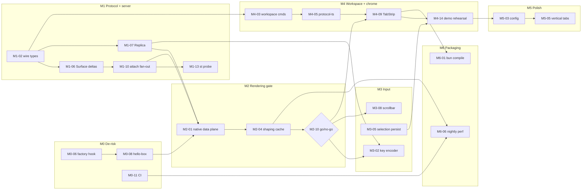

# 07 — Milestones and work breakdown

> **Addendum (00-grilling §F):** all ten open questions below are now decided — Q44 (hidden tabs), Q43 (`SetSelection` on the Data Plane), Q46 (`st-cli`, `st-config` crates: M1-13, M2-09, M5-03, M5-09 move there), Q47 (perf CI on a self-hosted runner; macOS decides the M2 gate), Q48 (`alacritty_terminal` from crates.io; default Session `Default`), Q40 (resize policy). V5/V6 in `HANDOVER.md` §5 cover shortcut propagation and `--asset` dlopen.

Status: planning document. Every decision referenced here is frozen in `00-grilling.md` (cited as Qn). Design detail lives in the sibling docs `01-architecture`, `02-protocol`, `03-server`, `04-client-native`, `05-client-app`, `06-testing-perf-ci`; this document only orders the work.

Conventions:

- **Effort** is in focused engineer-days (1 day ≈ 6 productive hours), serial. Hours per task size a single agent session; every task is ≤ 1 day.
- **Crate/package** uses the frozen layout (Q32): `st-proto`, `st-core`, `st-server`, `st-client-core`, `st-native`, `app`, `protocol-ts`, `vendor/gpuix`, plus `repo` for root files (justfile, CI, docs).
- **Acceptance** is something a second agent can run or observe without reading the diff.
- A milestone closes when Linux and macOS both pass its exit criteria; Windows may fail (Q3).

Total: **~53 engineer-days** serial, roughly 33–40 calendar days with the lanes in §Parallelization.

---

## M0 — De-risk & skeleton

**Goal:** Prove the toolchain end to end (Bun 1.4.0 → Node-API → gpuix-native → GPUI) on both platforms and paint one custom element from our own crate before writing terminal code.

**Exit criteria**
1. `just dev` on Linux (WSLg/Vulkan) and macOS (arm64) opens a window rendering `<hello-box>` from `crates/st-native`, not stock `gpuix-native`.
2. `vendor/gpuix` is pinned to the 0.6.0 tag; the Zed commit it depends on is recorded in `docs/PINS.md`; the factory-hook patch is ≤ 40 lines and applied by `just vendor-patch`.
3. CI runs `cargo test --workspace` and `bun test` on linux/macos (windows allowed-fail) with `target/` cached; a warm run finishes in < 15 min.
4. Cold GPUI build time per platform is recorded in `docs/PINS.md`.

**Effort:** 6 days, ~1 of them waiting on cold GPUI builds on two machines plus CI (Q12 says 10–20 min per cold build; expect more on WSL2).

**Risks addressed:** Q36(a) Zed pinned through gpuix; (b) hook kept as a local patch with an upstream PR; (d) Node-API/`ThreadsafeFunction` smoke test on day one; (e) WSLg Vulkan verified and documented.

| ID | Title | Crate | Description | Deps | Acceptance | h |
|---|---|---|---|---|---|---|
| M0-01 | Repo scaffold | repo | Cargo workspace with five empty crates, Bun workspaces for `app` and `protocol-ts`, `rust-toolchain.toml` (1.96), `.editorconfig`, `.gitignore`, licenses. Nothing beyond `fn main(){}`. | — | `cargo build --workspace` and `bun install` succeed on a clean checkout. | 2 |
| M0-02 | Vendor gpuix | vendor/gpuix | Add `remorses/gpuix` as a submodule at 0.6.0. Extract the Zed commit its `Cargo.toml` path-depends on into `docs/PINS.md` with the rule "never track Zed main" (Q36a). | M0-01 | `git submodule status` shows the tag; PINS.md lists both hashes. | 2 |
| M0-03 | Cold build on Linux | vendor/gpuix | Build `gpuix-native` on WSL2 and time it. Record Vulkan/WSLg prerequisites (`vulkaninfo`, mesa dozen version) in `docs/DEV.md`. | M0-02 | `.node` produced; cold/warm times in PINS.md. | 4 |
| M0-04 | Counter example under Bun (Linux) | vendor/gpuix | Run gpuix's React counter with `bun` instead of `node`; click 50 times and resize to exercise `ThreadsafeFunction` re-entry from GPUI's main thread (Q36d). | M0-03 | Counter increments; no crash or hang over 2 min; findings in DEV.md. | 3 |
| M0-05 | Cold build + counter on macOS | vendor/gpuix | Repeat M0-03/M0-04 on macOS arm64; record Xcode/Metal prerequisites and timings. | M0-04 | Same result as M0-04 on macOS; timings appended to PINS.md. | 4 |
| M0-06 | Factory-registration hook | vendor/gpuix | ~30-line patch letting an embedding crate pass extra `CustomElementFactory` instances before `GpuixRenderer::init` runs `with_defaults()` (Q12). Stored as `patches/0001-factory-hook.patch`, applied by `just vendor-patch`; open a draft upstream PR and link it from PINS.md (Q36b). | M0-03 | Patch applies idempotently twice; `cargo build -p gpuix-native` passes; PR URL recorded. | 5 |
| M0-07 | `st-native` skeleton | st-native | `cdylib` with `napi` derive depending on `gpuix-native` as rlib; forwards its napi surface and registers our factories via M0-06. Output copied to `packages/app/native/`. | M0-06 | `bun -e 'require("./native/st_native.node")'` loads on both platforms. | 4 |
| M0-08 | `<hello-box>` element | st-native | `CustomElement` painting a rounded quad plus one shaped text run; reads `color` from props to prove prop plumbing. | M0-07 | Element paints; changing `color` in JSX repaints. | 3 |
| M0-09 | `app` skeleton | app | React + `@gpuix/react` entry loading the `st-native` `.node`; renders `<hello-box>`; `bun --hot` dev loop works. | M0-08 | `just dev` opens the hello-box window on Linux and macOS. | 3 |
| M0-10 | justfile | repo | Recipes `build-native`, `dev`, `server`, `test`, `fmt`, `lint`, `vendor-patch`, `clean-vendor`, each with a one-line comment. | M0-09 | `just --list` shows recipes; `just test` runs cargo and bun tests. | 2 |
| M0-11 | CI skeleton | repo | GitHub Actions matrix ubuntu/macos/windows (`continue-on-error`); caches cargo registry and `target/` keyed on the Zed pin; runs `just test`. | M0-10 | Green PR run; warm run < 15 min with a visible cache hit. | 4 |
| M0-12 | `docs/DEV.md` | repo | Prerequisites, first build, WSL2 pitfalls (dozen Vulkan, `LIBGL_ALWAYS_SOFTWARE` fallback), how to re-pin. Links to `06-testing-perf-ci`. | M0-05, M0-11 | A fresh agent following DEV.md reproduces M0-09 without questions. | 2 |

---

## M1 — Protocol + server core

**Goal:** A running `superterminald` that owns one PTY and one authoritative `alacritty_terminal` state machine per Surface and streams Snapshot/Delta frames to a headless client whose Replica matches byte for byte.

**Exit criteria**
1. `st probe --cmd htop` prints a live, correct 80×24 grid to stdout from a Replica fed only by Snapshot + Deltas.
2. `proptest`: for random byte streams, `Replica(snapshot0 + deltas…) == Surface.snapshot()` over 10 000 cases.
3. An integration test starts a real server, runs `bash -c 'printf …'`, asserts Snapshot content and `Exited{code}`.
4. A `Hello` with a lower major version is refused with a readable error (Q31).

**Effort:** 8 days.

**Risks addressed:** none of Q36 directly; produces the fixtures M2 needs to measure Q36(c) and puts the Q7/Q16 delta design under test before any pixels exist.

| ID | Title | Crate | Description | Deps | Acceptance | h |
|---|---|---|---|---|---|---|
| M1-01 | Frame codec + Hello | st-proto | `u32 len \| u16 type \| payload` little-endian framing with `postcard` payloads; `Hello{proto_version, build_id}`, `HelloAck`, `HelloReject` (Q15, Q31). Streaming decoder tolerant of partial reads. | M0-01 | Round-trip tests; split-buffer test passes. | 4 |
| M1-02 | Grid + data-plane types | st-proto | `Cell{u32 cp, u16 style_idx, u8 flags}`, `Style`, `StyleTableUpdate`, `Snapshot`, `Delta{seq, dirty_rows, cursor, modes, title, scrollback_appended}` per Q16; messages `Attach`, `Detach`, `Input`, `Resize`, `FetchHistory`, `HistoryRows`, `SetSelection`, `SurfaceExited`. Type-id table documented in `02-protocol`. | M1-01 | `proptest` round trips green; an 80×24 Snapshot encodes < 20 KB. | 6 |
| M1-03 | Control-plane JSON types (Rust) | st-proto | Serde types for newline-delimited JSON (Q14): envelope with `id`, plus the M1 subset `create_surface`, `list_surfaces`, `kill_surface`. Workspace commands arrive in M4. | M1-01 | Fixtures in `st-proto/tests/fixtures/*.json` round-trip identically. | 3 |
| M1-04 | `VtEngine` trait + alacritty impl + style interner | st-core | Trait `feed`, `resize`, `take_damage() -> DirtyRows`, `snapshot`, `modes`, `title` implemented on `alacritty_terminal::Term` (Q8). Per-Surface interner maps colors/attrs to `u16 style_idx` and emits `StyleTableUpdate`. | M1-02 | Tests: CSI moves, SGR, alt-screen produce expected dirty rows; 10 000 random styles intern uniquely. | 7 |
| M1-05 | PTY spawn/resize/kill | st-core | `portable-pty` spawn with shell, cwd, env (`TERM=xterm-256color`), reader thread → channel. `kill` sends SIGHUP to the process group, SIGKILL after 2 s (Q21). | M0-01 | Spawning `bash -c 'echo hi; exit 3'` yields `hi` and exit code 3. | 5 |
| M1-06 | `Surface` delta producer | st-core | Owns PTY + engine; feeds output, drains damage into a pending `Delta` with monotonic `seq`, coalescing drains; `snapshot()` for new attachers. | M1-04, M1-05 | Feed 1 MB, take deltas at random points, apply to a Replica, equals snapshot. | 6 |
| M1-07 | Replica (grid only) | st-client-core | `Replica{cols, rows, cells, styles, cursor, modes, title, seq}` with `apply_snapshot`/`apply_delta` (rejects out-of-order `seq`). Scrollback ring lands in M2-06. No GPUI dependency. | M1-02 | `proptest` 10 000 cases: delta application == server snapshot. | 5 |
| M1-08 | Daemon skeleton + idle exit | st-server | Tokio; sockets at `$XDG_RUNTIME_DIR/superterminal/{control,data}.sock`; lockfile against duplicates; `--foreground`; `tracing`; Hello handshake on the data socket; exit after N idle minutes only when zero Surfaces exist (Q30). | M1-01 | A second daemon exits "already running"; `idle_exit_minutes=0.05` exits with no Surfaces, stays up with one. | 6 |
| M1-09 | Surface actor + registry | st-server | One task per Surface with an mpsc command channel and a `SurfaceId` registry; minimal control handlers from M1-03. | M1-06, M1-08 | `echo '{"id":1,"type":"create_surface"}' \| socat - UNIX:…` returns an id. | 5 |
| M1-10 | Attach/Detach, fan-out, throttle | st-server | On `Attach` send StyleTable + Snapshot then Deltas; fan out to N clients; per-client ~120 Hz throttle that always flushes a coalesced final state; slow clients lose intermediates, never the final (Q27). | M1-09 | Two clients, one paused 1 s, converge to identical grids. | 6 |
| M1-11 | Input + Resize | st-server | `Input` bytes to the PTY; `Resize` applies to engine and PTY (SIGWINCH); last-writer-wins across clients, recorded in `03-server`. | M1-09 | Typing `echo ok\n` shows `ok` in the next Delta. | 3 |
| M1-12 | Data-plane client | st-client-core | Blocking client: connect, Hello, `attach`, receive loop applying to Replica, `send_input`, `send_resize`; designed to run on a background thread for st-native. | M1-02, M1-07 | Unit test against an in-process fake server. | 5 |
| M1-13 | `st probe` CLI | st-client-core (bin `st`) | Creates a Surface via control JSON, attaches via data plane, redraws the Replica to stdout at 10 Hz, forwards stdin raw; `--dump` prints one Snapshot and exits. | M1-10, M1-11, M1-12 | `st probe --cmd htop` is visibly live; `--dump` matches the integration test. | 4 |
| M1-14 | History on server | st-server, st-core | Serve `FetchHistory{from,count}` from alacritty's scrollback; count `scrollback_appended` in Deltas; limit from config (default 10 000). | M1-10 | `seq 1 5000` then fetch rows 0..1000 returns `1..1000`. | 4 |
| M1-15 | Server integration tests | st-server | Spawn the daemon in a temp `XDG_RUNTIME_DIR`; run `bash -c 'printf "a\nb\n"'`; assert rows, exit code, `SurfaceExited`, and Hello major-mismatch rejection (Q31). | M1-13 | `cargo test -p st-server` green on Linux and macOS in CI. | 4 |

---

## M2 — Native grid rendering gate

**Goal:** `<terminal-grid>` paints server-fed Replicas fast enough that the rendering approach (Q11, Q26, Q27) is proven or rejected before anything is built on it.

**Exit criteria**
1. `just perf cat` (server cats a 100 MB file into a Surface) sustains p95 frame time < 16.6 ms on Linux and macOS at 120×40; result JSON committed under `docs/perf/`.
2. Attach-to-first-paint < 100 ms warm.
3. Go/no-go recorded as an ADR (run-shaping accepted, or the M2-11 fallback adopted).
4. The app shows a live `bash` prompt through `<terminal-grid>`; `hello-box` is gone.

**Effort:** 7 days, plus up to 1.5 days contingency (M2-11) if the gate fails.

**Risks addressed:** Q36(c) text-shaping cost measured before M3–M6 depend on it; Q36(e) WSL2 Vulkan under sustained load.

| ID | Title | Crate | Description | Deps | Acceptance | h |
|---|---|---|---|---|---|---|
| M2-01 | Native data-plane owner | st-native | Background thread running the M1-12 client; `ReplicaStore` keyed by `SurfaceId`; deltas wake GPUI through an async channel calling `cx.notify()` on the owning element (Q13). Socket path from env/prop. | M1-12, M0-07 | Snapshot logged within 50 ms of attach; no JS involved. | 6 |
| M2-02 | `<terminal-grid>` element + cell metrics | st-native | `TerminalGridFactory` via the M0-06 hook; props `surfaceId`, `fontFamily`, `fontSize`, `theme`; mount → `Attach`, unmount → `Detach`. Measures `'M'` advance and line height once per font; wide chars take 2 cells (Q26); layout derives `cols/rows` from bounds. | M2-01 | Element attaches and logs `cols×rows`; `cols` correct for a 960 px window at 14 px. | 7 |
| M2-03 | Paint pass + run segmentation | st-native | Per visible row: bg quads per same-bg run, shaped text per same-style run, cursor quad; inverse/dim/bold/italic/underline/strikethrough from attrs (Q16). Pure segmentation function unit-tested for style boundaries, wide chars, combining marks. | M2-02 | `ls --color` screenshot matches a reference; segmentation tests green. | 7 |
| M2-04 | Run-shaping cache | st-native | LRU keyed `(text, style_idx, font_id)` → shaped line, ~50 000 entries; hit/miss counters under `ST_PERF=1` (Q26, Q36c). | M2-03 | Hit ratio > 90% after warm-up during the flood; memory < 200 MB. | 5 |
| M2-05 | Dirty-row repaint + coalescing | st-native, st-client-core | Replica tracks rows dirty since last paint; element re-shapes only those; several Deltas between frames cause one `notify()` (Q27). | M2-04 | ≤ 1 paint per frame during flood; idle CPU < 1%. | 4 |
| M2-06 | Replica scrollback ring | st-client-core | Ring of history rows fetched in 1 000-row pages via `FetchHistory` (Q25); `scroll_offset`; `visible_rows(offset)` iterator used by paint. | M1-07, M1-14 | After 5 000 appended rows, offset 3 500 triggers exactly one fetch. | 5 |
| M2-07 | Style table + theme mapping | st-native, st-client-core | Apply `StyleTableUpdate` into the Replica; indexed colors through a theme palette prop; truecolor pass-through. | M2-03 | `for i in {0..255}` swatches match reference. | 4 |
| M2-08 | Resize path | st-native | Bounds change → `cols/rows` → debounced (50 ms) `Resize`; Replica resizes locally to avoid tearing before the server Snapshot lands. | M2-02 | Drag-resizing with `htop` shows no garbage frames. | 3 |
| M2-09 | Perf harness | st-client-core (bin `st`), repo | `st perf cat --size 100M` creates a Surface running `cat`; the app under `ST_PERF=1` records per-frame times to `docs/perf/<host>-<date>.json`; `just perf cat` wires both; `yes \| head` variant. | M2-05 | JSON with p50/p95/p99 and attach-to-first-paint. | 5 |
| M2-10 | Gate run + ADR | repo | Run M2-09 on both platforms at 120×40 and 200×60; write `docs/adr/ADR-0008-rendering-gate.md` with numbers and the decision; schedule M2-11 if failing. | M2-09, M2-07 | Exit criteria 1–2 met, or M2-11 scheduled with the measured shortfall. | 4 |
| M2-11 | Fallback spike (contingency) | st-native | Only on no-go: whole-row shaped-line cache keyed by row hash, or glyph atlas with per-cell quads; time-boxed; appended to the ADR. | M2-10 | New run meets the gate, or the project pauses for re-planning. | 8 |
| M2-12 | App uses `<terminal-grid>` | app | Replace `<hello-box>` with one `<terminal-grid surfaceId>`; a 10-line Bun control client creates the Surface (full client in M4-07). | M2-02 | `just dev` shows a live prompt; typing does nothing yet. | 3 |

---

## M3 — Input & interaction

**Goal:** The terminal is usable for real work: keys, mouse, selection, clipboard, native scrollbar over lazy history, resize, and full-screen apps behave like a mainstream terminal.

**Exit criteria**
1. `nvim`, `htop`, `btop`, `less`, nested `tmux` are usable for 10 minutes each without visual or input defects on Linux and macOS.
2. `docs/vttest.md` records vttest menus 1, 2, 3, 6, 8 with pass/fail per item; all "must" items pass.
3. A mouse selection survives Detach + Attach (Q17, Q24).
4. Wheel scrolling through 50 000 history lines is smooth with lazy paging (Q25).

**Effort:** 9 days.

**Risks addressed:** none of Q36 directly; validates the Q23 assumption that GPUI focus/key events reach the element under Bun/Node-API (residual of Q36d).

| ID | Title | Crate | Description | Deps | Acceptance | h |
|---|---|---|---|---|---|---|
| M3-01 | Focus + key interception | st-native | Element owns a `FocusHandle`, focuses on click/mount, handles `KeyDown`; declines keys in an `appShortcuts` prop so GPUI dispatches them to React's root `onKeyDown` (Q23). | M2-12 | Typing does not reach React; `cmd-t` does. | 4 |
| M3-02 | Key encoder + input send | st-client-core, st-native | Pure `encode_key(Key, Modifiers, Modes) -> Vec<u8>`: printable, control, CSI-modified arrows/function keys, DECCKM, keypad, Alt-as-Esc; Kitty protocol left as a flag (Q23). Encoded bytes go out as `Input`; `ST_PERF=1` logs key-to-repaint latency. | M3-01, M1-07 | ~120 table-driven cases match alacritty; latency < 1 frame (Q27). | 7 |
| M3-03 | Mouse selection | st-client-core, st-native | Drag computes `Selection{start,end,kind}` on the Replica; double-click word, triple-click line; overlay quad per row. Logic in `st-client-core`, events in `st-native`. | M2-05 | Word/line boundary tests; visual drag check. | 5 |
| M3-04 | Mouse reporting | st-client-core, st-native | When `modes.mouse != None`, encode X10/normal/button/any-motion with SGR 1006 and legacy fallback as `Input`; Shift forces local selection (Q24). | M3-03 | `htop` responds to clicks; Shift-drag selects in `htop`. | 5 |
| M3-05 | Selection persistence | st-server, st-native | `SetSelection` after drag end; server stores it in `view_state`; Snapshot includes it; element restores the overlay (Q17). | M3-03, M1-10 | Relaunching the app shows the same highlight; `st probe --dump` shows it. | 4 |
| M3-06 | Clipboard | st-native | Copy via GPUI clipboard; paste wrapped in bracketed-paste when the mode is set, `\r\n`→`\r`. | M3-03 | Multi-line paste into `nvim` insert mode arrives intact. | 3 |
| M3-07 | Wheel + alt-screen behaviour | st-native | Wheel changes `scroll_offset` locally; in alt-screen without mouse mode it sends arrow keys; auto-scroll to bottom only if already at bottom (Q25). | M2-06 | `less` scrolls; `seq 1 100000` keeps the view pinned. | 4 |
| M3-08 | Native scrollbar + paging ahead | st-native, st-client-core | GPUI scrollbar with track height = rows + history; thumb drag and track click; auto-hide with no history. Prefetch the next page within 200 rows of the cached edge; cap cache at 50 000 rows (Q25). | M3-07 | Dragging to top shows oldest rows with no "loading" frames. | 7 |
| M3-09 | Cursor styles + focus events | st-native, st-core | DECSCUSR shapes, configurable blink, hollow when unfocused; `CSI I`/`CSI O` when mode 1004 is set. | M3-01 | `nvim` changes cursor shape per mode; focus events visible in `st probe`. | 3 |
| M3-10 | IME / composed text | st-native | Implement GPUI's input handler so dead keys and IME composition insert via `Input`, with marked text at the cursor. | M3-02 | macOS `option-e e` gives `é`; Linux compose key works. | 5 |
| M3-11 | Resize correctness | st-core, st-native | Verify SIGWINCH ordering and that local Replica resize agrees with the server Snapshot; fix reflow gaps. | M2-08 | Resizing during `btop` leaves no stale columns; `tput cols` matches. | 3 |
| M3-12 | vttest checklist + encoder tests | st-core, st-client-core | Run vttest menus 1, 2, 3, 6, 8 via `st probe` and the GUI; record `docs/vttest.md`; fix defects (expect wide-char and insert/delete cases). `proptest` for selection normalisation and mouse encodings. | M3-04, M3-08 | `docs/vttest.md` complete with all "must" items passing; tests green. | 7 |
| M3-13 | Full-screen app matrix | repo | Manual matrix for `nvim`, `htop`, `btop`, `less`, `tmux`, `vim` with mouse; fix or file defects. | M3-12 | No open "blocker" rows in `docs/vttest.md`. | 4 |

---

## M4 — Workspace, sessions, tabs, persistence + React chrome

**Goal:** The Superlogical demo runs on our build: sessions and tabs in native-feeling chrome, all state in the server, client relaunch reattaching in well under a second with selection intact.

**Exit criteria**
1. Appendix A passes on Linux and macOS with relaunch-to-painted-grid < 500 ms warm.
2. Killing and restarting `superterminald` recreates the same Sessions/Tabs with shells in the same cwds from `workspace.json` (Q18).
3. A client with a bumped major protocol version shows the mismatch banner with a working "Restart server" action (Q31).
4. `bun test` covers TabStrip, palette, and WorkspaceStore via `TestGpuixRenderer`.

**Effort:** 10 days.

**Risks addressed:** the Q14 two-connection ordering (control creates Surface, then data-plane Attach) is exercised under real UI timing; the single-connection fallback is invoked only if races appear.

| ID | Title | Crate | Description | Deps | Acceptance | h |
|---|---|---|---|---|---|---|
| M4-01 | Workspace document + exited state | st-server, st-core | `Workspace{sessions, active}`, `Session{id,name,tabs}`, `Tab{id,surface_id,title}`, per-Surface `view_state{scroll_offset, selection}` (Q17, Q19), ULID ids. Child exit puts the Surface in `Exited{code}` with grid retained and `SurfaceExited` sent (Q22). | M1-09 | Tests: closing the last tab deletes the session, last session re-seeds (Q21); `exit 7` yields `Exited{7}` with readable grid. | 6 |
| M4-02 | Control-plane server | st-server | Newline-delimited JSON on `control.sock`: request/response by `id`; `workspace_changed` broadcast after every mutation (Q14). | M1-08, M1-03 | `socat`: `create_tab` returns a tab and an event follows. | 5 |
| M4-03 | Workspace commands | st-server | `create_session`, `rename_session`, `delete_session`, `switch_session`, `create_tab{cwd?}`, `close_tab` (kills Surface, Q21), `move_tab`, `set_active_tab`, `get_workspace`, `subscribe`. | M4-01, M4-02 | Integration test walks every command and checks `get_workspace`. | 6 |
| M4-04 | Persistence + cwd tracking | st-server, st-core | Child cwd via `/proc/<pid>/cwd` (Linux) and `proc_pidinfo` (macOS). Debounced (500 ms) atomic write of `$XDG_STATE_HOME/superterminal/workspace.json`; startup recreates the shape with new shells in those cwds; scrollback not persisted (Q18). | M4-03 | Kill and restart daemon: same sessions/tabs, `pwd` in each shell matches. | 6 |
| M4-05 | `protocol-ts` types | protocol-ts | TypeScript types plus runtime validation for every control message; tests load `st-proto/tests/fixtures/*.json`. | M4-03 | `bun test` green; fixture drift fails. | 4 |
| M4-06 | Control client + server spawn | app | `Bun.connect` on `control.sock`; if absent, `Bun.spawn(superterminald, {detached})` + `unref`, retry every 3 s (Q30); reconnect with backoff capped at 3 s. | M4-05 | App with no daemon starts one; killing the daemon shows the banner then recovers. | 5 |
| M4-07 | WorkspaceStore | app | Client projection of the server Workspace with optimistic mutations reconciled on `workspace_changed`; client-only state (geometry, focus, palette query) kept apart (Q17). | M4-06 | Fake-socket tests; no duplicate tabs under event reordering. | 5 |
| M4-08 | Command registry + keybindings | app | Typed `{id, title, shortcut, run()}` registry for the v1 command list (Q29); root `onKeyDown` matches shortcuts declined by M3-01; Ctrl on Linux, Cmd on macOS. | M4-07 | Every command has a shortcut and handler; `cmd-t` creates a tab. | 6 |
| M4-09 | TabStrip + session chip | app | Horizontal strip with the session chip at far left, titles, close buttons, exited badge slot; left padding reserved for traffic lights (Q20, Q28). Drag-reorder deferred. | M4-07 | `TestGpuixRenderer` renders N tabs with the active one highlighted. | 5 |
| M4-10 | Palette, session switcher, rename | app | `<anchored>` overlay with `<input>` and fuzzy list on `cmd/ctrl-k` (Q29); Switch Session lists sessions; Rename edits the chip inline; all via control commands. | M4-08 | Typing "sess" lists the three session commands; Appendix A step 8 passes. | 7 |
| M4-11 | Banners + version negotiation | app, st-server, st-native | Disconnected, reconnecting, server-restarted, version-mismatch banners; both planes check `proto_version` major; "Restart server" warns it kills processes (Q31). | M4-06, M1-01 | Bumping the client major shows the banner; action restarts the daemon. | 5 |
| M4-12 | Attach lifecycle across tabs | st-native, app | `<terminal-grid>` only for the active tab; switching unmounts (Detach) and mounts (Attach, snapshot < 100 ms). Keep-warm of inactive Replicas is an open question. | M2-02, M4-09 | New grid within one frame plus snapshot; no leaked attachments after 100 switches. | 4 |
| M4-13 | Chrome tests | app | `TestGpuixRenderer` snapshots for TabStrip, palette, banners; WorkspaceStore reducer tests. | M4-09, M4-10, M4-11 | `bun test` green in CI. | 4 |
| M4-14 | Demo rehearsal | repo | Run Appendix A on both platforms; `ST_PERF=1` logs first paint for relaunch timing; fix blockers; append timings to `docs/perf/`. | M4-10, M4-12, M4-04, M3-05 | Appendix A observations match on both platforms. | 4 |

---

## M5 — Polish

**Goal:** The client looks and behaves like a finished native app for daily use by its author on macOS and Linux.

**Exit criteria**
1. macOS uses `titlebarTransparent`, `windowBackground: 'blurred'`, traffic-light offsets from `blurred-window.tsx` (Q28); Linux picks its background by probe or config.
2. `~/.config/superterminal/config.toml` controls font, shell, theme, background mode, keybinding overrides for both binaries (Q34).
3. Vertical tabs, exited-surface UX (Q22), bell, OSC titles with cwd inheritance, and `st status`/`st ls`/`st kill-server` work.
4. The author uses superterminal daily for five consecutive working days without falling back.

**Effort:** 7 days.

**Risks addressed:** Q36(e) Linux/WSL2 compositor differences via the background probe; no other Q36 items.

| ID | Title | Crate | Description | Deps | Acceptance | h |
|---|---|---|---|---|---|---|
| M5-01 | macOS blurred window | app | Apply `blurred-window.tsx` options verbatim; TabStrip padding from `trafficLightX`; check light and dark desktops (Q28). | M4-09 | Traffic lights clear of the session chip in screenshots. | 3 |
| M5-02 | Linux background probe | app | Detect compositor alpha support at startup, choose `transparent` or `opaque`; `window.background` overrides (Q28). | M5-03 | WSLg opens opaque without artefacts; Wayland with alpha is transparent. | 3 |
| M5-03 | Config loaders | st-core, st-server, app | Rust (`toml` crate) reads `shell`, `env`, `scrollback_lines`, `idle_exit_minutes`; TS (Bun TOML import) reads `font.*`, `theme`, `window.background`, `keybindings` and passes them as props/registry overrides; invalid files warn and use defaults (Q34). | M1-05, M4-08 | Tests for defaults/partial/invalid; changing `font.size` changes cell metrics. | 6 |
| M5-04 | Theme palette | st-native, app | Default dark and light palettes (16 ANSI + fg/bg/cursor/selection) in TOML; `theme` prop drives M2-07 mapping plus selection and cursor colors. | M5-03 | `for i in {0..15}` swatches match the configured palette. | 3 |
| M5-05 | Vertical tabs | app | "Toggle Vertical Tabs" moves the strip to a left column with wider titles; stored as client-only config. | M4-09 | Appendix A step 10 passes; grid recomputes columns cleanly. | 4 |
| M5-06 | Exited-surface UX | app, st-native | "exited (code)" badge, greyed grid; Enter or click closes the tab (Q22). | M4-01 | `exit` shows the badge; Enter closes; last session re-seeds. | 3 |
| M5-07 | Bell | st-core, st-native, app | BEL sets a `bell` flag in the next Delta; brief flash; inactive tab gets a dot until focused. | M1-06 | `printf '\a'` in an inactive tab shows the badge. | 3 |
| M5-08 | Titles + cwd inheritance | st-core, st-server, app | OSC 0/2 sets tab title (fallback process name); OSC 7 updates cwd; New Tab passes the active Surface's cwd to `create_tab{cwd}`. | M4-04 | `cd /tmp && cmd-t` opens in `/tmp`; `nvim file` sets the title. | 4 |
| M5-09 | Logging, status CLI, robustness | st-server, st-client-core | `tracing` to `$XDG_STATE_HOME/superterminal/logs/` with rotation; `st status`, `st ls`, `st kill-server`. Client disconnect mid-write, PTY read errors, EPIPE never take down other Surfaces. | M4-03 | Commands print expected tables; killing the client 20× during a flood leaves all Surfaces alive. | 7 |
| M5-10 | Fonts, emoji, HiDPI | st-native | System fallback for emoji/CJK, wide glyphs clipped to two cells, missing configured font falls back with a warning (Q26); recompute metrics on scale-factor change. | M2-02 | `echo '日本語 🎉'` renders without overlap; moving between 1× and 2× displays stays crisp. | 5 |
| M5-11 | Daily-use bug bash | repo | Five days of dogfooding with a `docs/bugbash.md` log; fix P0/P1. | M5-01…M5-10 | No P0 open; P1 count recorded. | 6 |

---

## M6 — Packaging & release-ability

**Goal:** One command produces installable artefacts for macOS and Linux, and a nightly perf run guards the M2 gate numbers.

**Exit criteria**
1. `just release` yields `superterminal` (Bun-compiled, `.node` embedded via `--asset`) with `superterminald` beside it on both platforms (Q35).
2. An unsigned `Superterminal.app` launches from Finder on a clean macOS account and spawns the daemon.
3. Nightly CI runs the perf harness and fails on > 20% p95 regression against `docs/perf/baseline.json`.
4. `README.md`, `docs/DEV.md`, `CONTEXT.md`, `HANDOVER.md` are current.

**Effort:** 5 days.

**Risks addressed:** Q36(d) residual — Bun `--compile --asset` loading of a Node-API module verified; Q36(a) release pins checked by CI.

| ID | Title | Crate | Description | Deps | Acceptance | h |
|---|---|---|---|---|---|---|
| M6-01 | Bun single-file client | app, repo | `bun build --compile --asset native/*.node --outfile superterminal`; resolve the `.node` from the embedded asset at runtime; confirm `process.dlopen` works from the compiled binary (Q35). | M0-07 | Binary runs on a machine without `bun`. | 5 |
| M6-02 | Daemon placement + build ids | app, st-server, st-proto | Release-build `st-server`; client looks beside its own executable, then `$PATH`, then config. `build_id` = git sha + dirty flag stamped into both binaries and logged on Hello. | M4-06 | Both binaries moved to a fresh dir work; `st status` shows matching build ids. | 4 |
| M6-03 | macOS `.app` skeleton | repo | `Superterminal.app/Contents/{MacOS,Resources}`, `Info.plist`, placeholder icon, both binaries in `MacOS/`, unsigned; `just app-bundle`. | M6-01, M6-02 | Double-click launches; Gatekeeper bypass documented. | 5 |
| M6-04 | Linux tarball + `.desktop` | repo | Tarball with both binaries, `superterminal.desktop`, icon; `just tarball`. | M6-01, M6-02 | Extract and launch from a fresh Ubuntu account. | 2 |
| M6-05 | Release workflow | repo | Tag-triggered job building M6-03/M6-04 per platform, attached to a draft release. | M6-03, M6-04 | Draft release holds four artefacts. | 4 |
| M6-06 | Nightly perf CI | repo | Scheduled `just perf cat` on a runner with a real Vulkan/Metal device (self-hosted; see §Open questions); compare to `baseline.json`; fail on > 20% regression. | M2-09 | Nightly posts results; an injected slowdown fails. | 5 |
| M6-07 | Clean-machine smoke tests | repo | Run Appendix A from release artefacts only on a fresh Linux VM and macOS account. | M6-05 | Appendix A passes from artefacts. | 4 |
| M6-08 | Docs pass | repo | Update README, `docs/DEV.md`, `CONTEXT.md` vocabulary (Q19), `HANDOVER.md` with status and known issues; link ADRs. | M6-07 | A reviewer builds and runs from docs alone. | 4 |
| M6-09 | Perf baseline commit | repo | Promote the best M2-10/M4-14 runs to `docs/perf/baseline.json` with hardware notes. | M6-06 | Nightly compares against it. | 1 |
| M6-10 | Windows deferral note | repo | Confirm the Windows CI job compiles or record the exact failure; `docs/windows.md` lists ConPTY and win32 gpuix blockers (Q3). | M0-11 | Note exists; job stays allowed-fail. | 1 |

---

## Cross-milestone dependency graph

`M2-10` (rendering go/no-go) is the single hard gate; everything visual downstream waits on it. `M1-02` (frozen wire types) is the fan-out point that lets the server, native, and chrome lanes proceed concurrently.

---

## Parallelization guidance

Work splits into three lanes separated by four sync points. Run at most one agent session per lane at a time; merge only at sync points.

**S0 — end of M0.** Nothing in M1 starts before M0-09 paints on Linux. M0-05 (macOS) runs concurrently with M0-06…M0-09.

**S1 — protocol freeze (M1-01…M1-03 merged).** Three lanes open:

| Lane | Tasks | Notes |
|---|---|---|
| Server | M1-04…M1-06, M1-08…M1-11, M1-14, M1-15, then M4-01…M4-04 | Owns `st-core`, `st-server`. May proceed into M4 server work before M2 closes; none of it touches rendering. |
| Native | M1-07, M1-12, M1-13, then M2-01…M2-12 | Owns `st-client-core`, `st-native`. Needs a running server from M2-09 on, so it lags the server lane by ~2 days. |
| Chrome | M4-05, M4-07, M4-08, M4-10 | Owns `app`, `protocol-ts`. Built against a fake control socket and `TestGpuixRenderer`; only M4-09 (hosts `<terminal-grid>`) and M4-12 wait for M2-10. |

**S2 — M2-10 go/no-go.** On "go", M3 (native lane) and M4-09…M4-14 (chrome lane) run concurrently, integrating at M4-12 (attach lifecycle) and M4-14 (demo rehearsal). On "no-go", only M2-11 proceeds; the chrome lane may continue on fake sockets.

**S3 — M4-14 demo passes.** M5 splits by crate: M5-07, M5-08, M5-09 and the Rust half of M5-03 (server lane); M5-10 (native lane); M5-01, M5-02, M5-04…M5-06 (chrome lane). M6-01 and M6-02 may start as soon as M4-06 exists, in parallel with M5.

Rules for concurrent sessions:
1. `st-proto` changes after S1 need a version bump and a single owner; other lanes rebase, never edit.
2. Every session ends with `just test` green on Linux; macOS verification is batched at milestone close.
3. Perf numbers (M2-09, M4-14, M6-06) are recorded only on a quiet machine, never on a shared CI runner.

Calendar with three lanes: M0 6d → M1 5d wall → M2 6d wall → M3 ∥ M4 ~9d wall → M5 4d wall → M6 3d wall ≈ 33–40 calendar days.

---

## Appendix A — Demo script

Reproduces the Superlogical demo on our build. Prerequisites: M4 complete; `just dev` or a release build; no daemon running (`st kill-server`); default font and theme.

| # | Step | Expected observation |
|---|---|---|
| 1 | Launch `superterminal`. | No daemon exists, so the client spawns one; a window with one tab and a shell prompt appears in < 1.5 s cold; `ST_PERF=1` logs first paint. macOS: transparent titlebar, blurred background, strip clear of traffic lights (M5). |
| 2 | Type `i=0; while true; do echo "count $i"; i=$((i+1)); sleep 1; done`, Enter. | One line per second; view pinned to bottom; scrollbar thumb appears and shrinks as history grows. |
| 3 | `cmd/ctrl-t`, then `echo hello from tab 2`. | Second tab opens in the same cwd (M5-08) with a fresh shell; strip shows two tabs, second active. |
| 4 | Return to tab 1; drag-select `count 12` (or whatever is on screen). | Highlight is instant (local Replica); on mouse-up the server stores it. Note the counter value *N*. |
| 5 | Quit (`cmd-q` / `ctrl-q`); wait 5 s. | Window closes. `st status` shows the daemon with 2 Surfaces; `st probe --dump <surface1>` shows the counter still advancing. |
| 6 | Relaunch; start a stopwatch. | Both tabs, tab 1 active, grid already painted in < 500 ms warm ("half a dock bounce"). Counter reads about *N + 5* and continues. `count 12` is still highlighted. |
| 7 | Wheel up through history; drag the thumb to top, then bottom. | Smooth scrolling; oldest lines fetched lazily with no visible loading; returning to bottom re-enables auto-scroll. |
| 8 | `cmd/ctrl-k` → `new session` → name `Work`; `cmd/ctrl-k` → `switch session` → `Demo`, then back. | Palette fuzzy-matches; the chip changes between `Demo` and `Work`; the strip swaps to that session's tabs; `Work` has one fresh tab. |
| 9 | In `Work` run `htop`; click a column header; press `q`. | Click is forwarded (mouse mode); Shift-drag would select instead; `q` restores the primary screen. |
| 10 | `cmd/ctrl-k` → `toggle vertical tabs`. | Strip moves to a left column with full titles; the grid re-lays out without garbage frames (M5-05). |
| 11 | Type `exit` in the `Work` tab. | "exited (0)" badge, grid still readable; Enter closes the tab; `Work` was one tab, so the session is deleted and the chip returns to `Demo` (Q21, Q22). |
| 12 | `st ls`; `st kill-server`; relaunch. | `st ls` lists `Demo` with two tabs and cwds. After restart the same shape returns with fresh shells in the same cwds; the counter is gone (Q18). |

Record in `docs/perf/demo-<host>-<date>.json`: cold launch (step 1), warm relaunch to painted grid (step 6), tab switch latency (steps 3–4), palette open latency (step 8).

---

## Open questions

Gaps or conflicts found while decomposing the frozen decisions; none is decided here.

1. **Keep-warm of inactive tabs (M4-12).** Q13 says the native module keeps "replicas per attached Surface". Stay attached to every tab in the active Session (instant switch, more fan-out and memory) or only the visible one (Snapshot per switch, < 100 ms)? The plan assumes visible-only; `04-client-native` should decide.
2. **Which plane carries `SetSelection`.** Q17 routes UI-state edits through control messages; Q24 computes selection in Rust on the Replica. The task list sends it over the data plane to avoid a Rust→JS hop, which means `view_state` mutations arrive on two sockets. `02-protocol` should settle this.
3. **Home of the `st` CLI and config loaders.** The frozen crate list (Q32) has no `st-cli` or `st-config`. This plan puts the `st` binary in `st-client-core` and TOML parsing in `st-core`/`app`. If `01-architecture` adds a crate, M1-13, M2-09, M5-03, M5-09 move without changing.
4. **Headless GPU for nightly perf CI (M6-06).** GitHub-hosted Linux runners have no Vulkan device, and lavapipe would not measure real shaping cost. Self-hosted runner on the dev box, or a macOS runner with Metal? `06-testing-perf-ci` should choose; the plan budgets a self-hosted runner.
5. **`alacritty_terminal` version.** Pin to what Zed's vendored checkout uses (fewer duplicate crates, same pin discipline as Q36a) or latest crates.io? Plan assumes Zed's version.
6. **Perf gate validity on WSL2.** Q36(e) accepts WSLg Vulkan as a requirement, but a gate that fails only under dozen/D3D12 translation should probably not block M2. Proposed: macOS numbers decide; WSL2 numbers are recorded and must be within 2×.
7. **Bun `--compile --asset` with Node-API (M6-01).** Whether `process.dlopen` accepts a path inside the compiled bundle or needs extraction to a temp dir is unverified. If extraction is required, add a first-run step caching under `$XDG_CACHE_HOME`.
8. **Shortcut declining in the element (M3-01).** Q23 says the element declines app shortcuts so GPUI dispatches them to React. Whether gpuix's event bridge propagates from a `CustomElement` to a React ancestor, or a napi event is needed, must be confirmed in `04-client-native`; the M0-06 patch may grow a few lines.
9. **Resize policy with several clients (M1-11).** Last-writer-wins thrashes when two clients differ in size; tmux uses smallest-client. v1 has one client in practice, but `03-server` should record the policy.
10. **Default session name.** The demo shows `Demo`/`Work`; the plan assumes the initial Session is `Default` and renamed by the user. Confirm in `05-client-app`.
